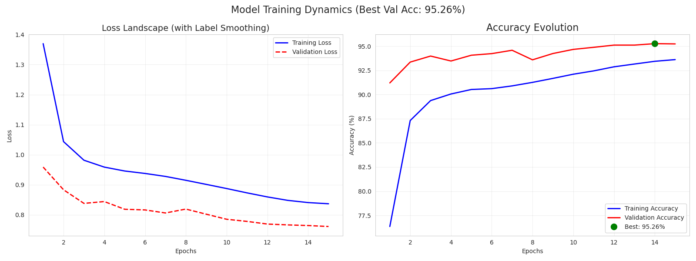
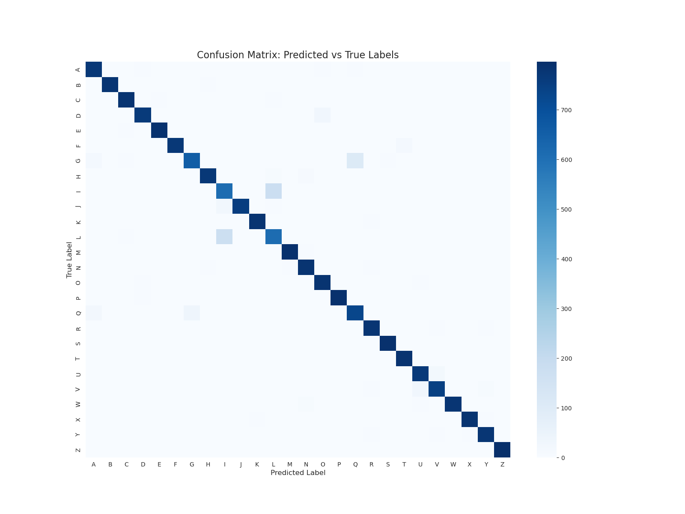

# 🧠 EMNISTNet: High-Performance Handwritten Letter Classification


<br>

## 📌 Project Overview
This project was developed for the **Codecademy Machine Learning Bootcamp Contest (Jan 2026)**. The challenge was to build a neural network to classify handwritten letters (EMNIST dataset) from scratch, strictly adhering to a **<1,000,000 parameter limit**.

My solution, **EMNISTNet**, achieves **94.87% accuracy** on the held-out test set using a highly optimized CNN architecture with only **~697k parameters**.

<br>

## 🚀 Key Results
| Metric | Performance | Notes |
| :--- | :--- | :--- |
| **Test Accuracy** | **94.87%** | High generalization (Validation Acc: 95.26%) |
| **Model Size** | **0.7 MB** | 697,594 Parameters (70% of budget) |
| **Inference** | **GPU/CPU** | Auto-detects hardware via `predict.py` |

<br>

## 🛠️ Technical Approach & MLOps
To achieve top-tier performance within constraints, I implemented:

* **Architecture:** Custom VGG-style CNN with Modular `ConvBlocks` (GELU Activations + BatchNorm).
* **Optimization:** `AdamW` optimizer + `OneCycleLR` scheduler for superconvergence (15 epochs).
* **Data Engineering:** Custom pipeline with `FixOrientation`, `RandomRotation`, and `GaussianNoise` for robustness.
* **Regularization:** Heavy Dropout + **Label Smoothing (0.1)** to handle ambiguous letters (e.g., 'I' vs 'l').
* **Reproducibility:** SHA256 integrity checks and automated model checkpointing.

<br>

## 📊 Visualizations
### Training Dynamics
 

### Confusion Matrix


<br>

## 💻 How to Run
1. Clone the repository.
2. Install dependencies: `pip install torch torchvision numpy`
3. Run inference:
   ```bash
   python predict.py
   ```
<br>
<br>

## 🤝 Contact
I am a Data Science enthusiast passionate about Machine Learning and statistical modeling. 

If you have any questions about this project or would like to connect, feel free to reach out!

<br>

---
**Author:** Milton Rodolfo Valle Lora

**LinkedIn:** [Please click here](https://www.linkedin.com/in/miltonvallelora/)

---
